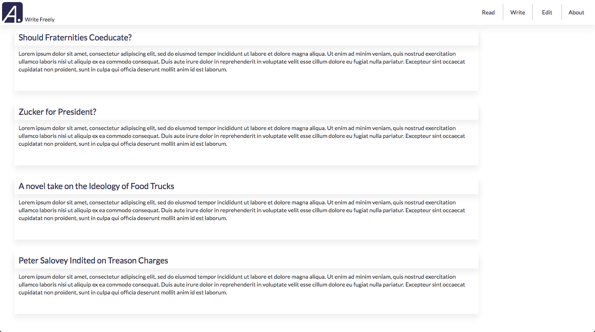
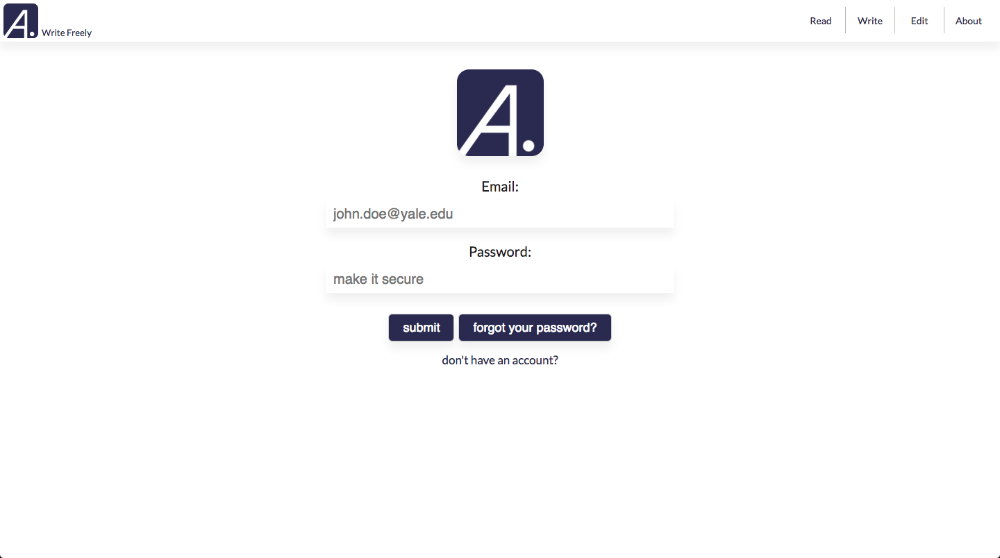
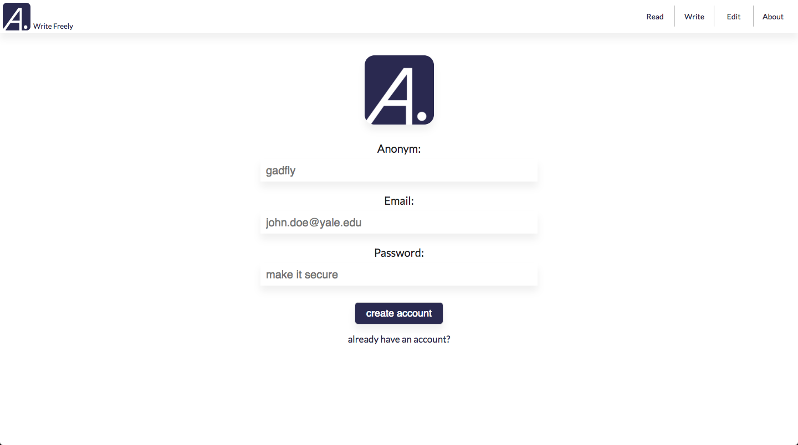

<h1 align='center' color='#282D4F'>
 Write Freely
</h1>

#### Anonym is a publication with the sole purpose of encouraging open and honest conversation on campus.

#### By allowing writers and editors to remain anonymous, they will be free to generate original, thought-provoking content which may not adhere to standard practices of discourse. As a result, readers will have access to the unadulturated thoughts of their peers.

#### I undertook this as a personal project in light of my dissatisfaction with degree of authenticity of publications on campus. I also wanted to get a introduction to the modern web development stack. 

## Project Overview

Completed: 
* Introduction to interface design with Sketch
* Version control and source code managment with Git
* Github as a collaboration tool
* Introduction to static webpage design with HTML
* Webpage styling with CSS
* Fundamentals of dynamic webpage design with JavaScript, HTML, and CSS
* Front-end development with Facebook's ReactJS
* Back-end developement with Google's Firebase

To Do: 
* Tidy up user authentication through Firebase
* Include writer pages (submission page, edits page)
* Include editor pages (landing page, apply page, editing page)
* Implement infinite scroll on the read page 

## Landing Page

 

* Understanding React Components in abstraction is essential to getting over the framework's learning curve.
* Those familiar with HTML should think of the React.Component base class as a fleshed out div element. 

### Key Insight - The Virtual DOM

The DOM (Document Object Model) is an API that maps a HTML document to a tree structure wherein each node is an object representing a part of the document. It then acts as an interface between JavaScript and the document itself, which allows for the creation of dynamic web pages.

The virtual DOM is used for efficient re-rendering of the DOM. It is an abstraction of the HTML DOM. It is lightweight and detached from the browser-specific implementation details. Since the DOM itself was already an abstraction, the virtual DOM is, in fact, an abstraction of an abstraction.

We aim to re-render the virtual tree only when the state (data) changes. So using an observable to check if the state has changed is an efficient way to prevent unnecessary re-renders, which would cause lots of unnecessary tree diffs. If nothing has changed, we do nothing.

A virtual DOM is nice because it lets us write our code as if we were re-rendering the entire scene. Behind the scenes we want to compute a patch operation that updates the DOM to look how we expect. So while the virtual DOM diff/patch algorithm is probably not the optimal solution, it gives us a very nice way to express our applications. We just declare exactly what we want and React/virtual-dom will work out how to make your scene look like this. We don't have to do manual DOM manipulation or get confused about previous DOM state. We don't have to re-render the entire scene either, which could be much less efficient than patching it.

## Sign In Page 

 

* Understanding React Components in abstraction is essential to getting over the framework's learning curve

## Sign Up Page

 

